> Last Updated: January 4th, 2026

# KrossKube

<div align="center">

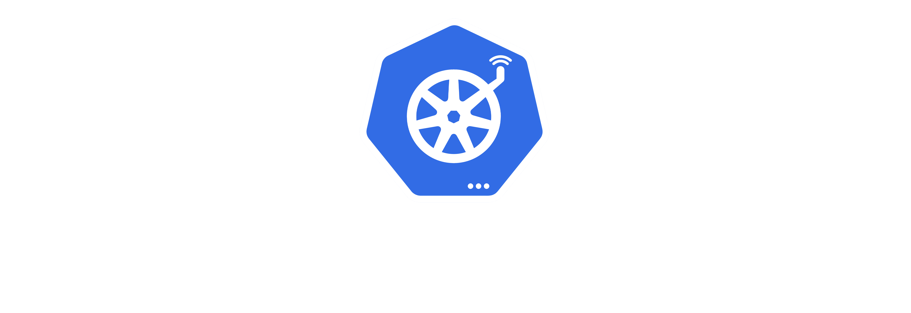

_Figure: The KrossKube logo_

</div>

---

<div align="center">

**KrossKube** is a Model-Driven Engineering (MDE) solution designed to address the complexities of managing native Kubernetes resources across <ins>multiple clusters</ins>.

<br/>

[](https://kubernetes.io/)
[](https://www.eclipse.org/modeling/)
[](https://www.eclipse.org/Xtext/)
[](https://www.eclipse.org/modeling/emf/)
[](https://www.eclipse.org/epsilon/)
[](https://www.eclipse.org/ocl/)

</div>

<br/>

> [!NOTE]
> KrossKube is a project supervised by Pr. [Mahmoud El Hamlaoui](https://github.com/ELHAMLAOUI), proposed and maintained under the [@m-elhamlaoui](https://github.com/m-elhamlaoui) organization.

## Team Members<a id="team-members"></a>

<table align="center">
    <tr>
        <td align="center">
            
            <br /><sup>BIDIOUANE <br /> Haitam</sup><br />
            <span><a href="https://github.com/sch0penheimer"><code>@sch0penheimer</code></a></span>
            <br /> <br />
            <a href="https://github.com/sch0penheimer" 
            title="GitHub">
                
            </a>
            <a href="https://www.linkedin.com/in/haitam-bidiouane/" 
            title="LinkedIn">
                
            </a>
        </td>
        <td align="center">
            
            <br /><sup>ELMOUDNI <br />Yassine</sup><br />
            <span><a href="https://github.com/Mdn753"><code>@Mdn753</code></a></span>
            <br /> <br />
            <a href="https://github.com/Mdn753" title="GitHub">                    
                
            </a>
            <a href="https://www.linkedin.com/in/el-moudni-yassine-064482333/" title="LinkedIn">
                
            </a>
        </td>
        <td align="center">
            
            <br /><sup>GHOUZALI <br /> Ayoub</sup>
            <br />
            <span><a href="https://github.com/AyoubGhouzali"><code>@AyoubGhouzali</code></a></span>
            <br /> <br />
            <a href="https://github.com/AyoubGhouzali" title="GitHub">
                
            </a>
            <a href="https://www.linkedin.com/in/ayoub-ghouzali-976369251/" title="LinkedIn">
                
            </a>
        </td>
        <td align="center">
            
            <br /><sup>ECHAIB <br /> Ayoub</sup><br />
            <span><a href="https://github.com/Ayoech"><code>@Ayoech</code></a></span>
            <br /> <br />
            <a href="https://github.com/Ayoech" title="GitHub">
                
            </a>
            <a href="https://www.linkedin.com/in/ayoub-echaib/" title="LinkedIn">
                
             </a>
        </td>
    </tr>
</table>

## Table of Contents

### [Section I: Foundation & Architecture](#i-foundation--architecture)

1. [Overview](#1-overview)

   - [1.1 Problem Statement](#11-problem-statement)
   - [1.2 Solution Approach](#12-solution-approach)

2. [Architecture & Metamodel](#2-architecture--metamodel)

   - [2.1 Metamodel Sub-Packages](#21-metamodel-sub-packages)
     - [2.1.1 Kubernetes Native Packages](#211-kubernetes-native-packages)
       - [2.1.1.1 Runtime Resources](#2111-runtime-resources)
       - [2.1.1.2 Network Resources](#2112-network-resources)
       - [2.1.1.3 Storage Resources](#2113-storage-resources)
       - [2.1.1.4 Security Resources](#2114-security-resources)
     - [2.1.2 KrossKube Multicluster Package](#212-krosskube-multicluster-package)

### [Section II: Implementation & Technology Stack](#ii-implementation--technology-stack)

3. [Technology Stack](#3-technology-stack)

   - [3.1 Eclipse Modeling Framework](#31-eclipse-modeling-framework)
     - [3.1.1 Obeo Designer Integration](#311-obeo-designer-integration)
     - [3.1.2 Ecore Metamodeling](#312-ecore-metamodeling)
     - [3.1.3 EMF Code Generation](#313-emf-code-generation)
     - [3.1.4 Object Constraint Language (OCL)](#314-object-constraint-language-ocl)
   - [3.2 Domain-Specific Language](#32-domain-specific-language)
     - [3.2.1 Xtext Grammar Definition](#321-xtext-grammar-definition)
     - [3.2.2 Runtime Eclipse IDE Integration](#322-runtim-eclipse-ide-integration)
   - [3.3 Model-To-Text Transformation Engine](#33-model-to-text-transformation-engine)
     - [3.3.1 Epsilon Generation Language (EGL)](#331-epsilon-generation-language-egl)
   - [3.4 Xtend Integration](#34-xtend-integration)

4. [CRD Manifests Generation](#4-code-generation)
   - [4.1 Template-Based Generation](#41-template-based-generation)
   - [4.2 Model-to-Text Transformations](#42-model-to-text-transformations)

### [Section III: Usage & Reference](#iii-usage--reference)

5. [Examples](#5-examples)

   - [5.1 Basic Models Examples](#51-basic-models-examples)
   - [5.2 Advanced Models Examples](#52-advanced-models-examples)

---

6. [End-to-end Practical Walkthrough](#6-walkthrough)

## 1. Overview

### 1.1 Problem Statement

Managing Kubernetes resources across multiple clusters presents significant operational challenges. Organizations typically face fragmented deployment patterns, inconsistent resource definitions, and complex orchestration workflows when operating distributed Kubernetes environments. Traditional multi-cluster management approaches rely on manual synchronization of YAML manifests and custom scripts.

<div align="center">

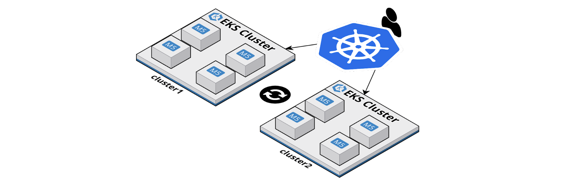

_Figure: Kubernetes Multi-Cluster Management_

</div>

<ins>**KrossKube**</ins> transforms this paradigm by introducing **`high-level abstractions`** that capture the essential characteristics of multi-cluster resource management while automatically generating the necessary Kubernetes Custom Resource Definitions (CRDs).

### 1.2 Solution Approach

<ins>**_KrossKube_**</ins> addresses this paradigm through a **Model-Driven Engineering** approach that establishes **formal & normalized** **`high-level abstractions`** for multi-cluster Kubernetes resource management. The solution introduces a **_metamodel-based framework_** for defining MultiCluster resources that encapsulate deployment policies, cluster targeting strategies, and resource specifications within unified abstractions.

The core innovation lies in <ins>transforming</ins> **high-level MultiCluster resource models** into standard <ins>**Kubernetes Custom Resource Definitions**</ins> through automated `Model-to-Text` YAML code generation. This approach enables declarative specification of multi-cluster deployment intent while maintaining compatibility with existing Kubernetes tooling and workflows.

## 2. Architecture & Metamodel

KrossKube's Model-Driven Engineering foundation establishes the theoretical and practical framework for systematic transformation of abstract resource models into concrete Kubernetes manifests.

### 2.1 Metamodel Layer

<div align="center">

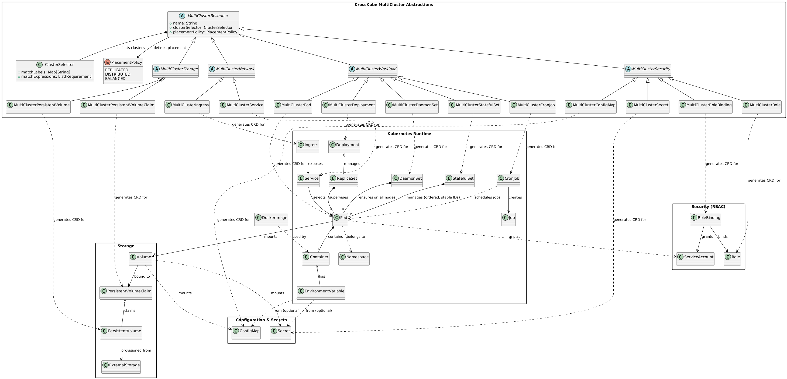

_Figure: The KrossKube Metamodel UML Class Diagram_

**_(Click on the figure for a full-screen view)_**

</div>

The metamodel layer defines the abstract syntax and semantic rules for MultiCluster resource specifications. At its core, the `MultiClusterResource` abstract class establishes the foundational interface for all multi-cluster abstractions, providing common attributes for cluster selection and placement policy definition.

Specialized abstract classes extend this foundation to address specific resource categories, and concrete MultiCluster classes inherit from their respective abstract parents, establishing one-to-one mappings with underlying Kubernetes resource types.

### 2.1 Metamodel Sub-Packages

The KrossKube metamodel architecture is organized into distinct sub-packages that provide modular separation between native Kubernetes resource definitions and multi-cluster abstractions.

#### 2.1.1 Kubernetes Native Packages

The native Kubernetes packages provide comprehensive modeling support for standard Kubernetes resources, organized by functional domain. These packages establish the foundational abstractions that multi-cluster resources extend and compose.

<div align="center">

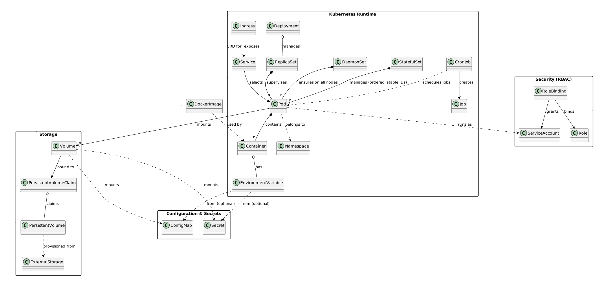

_Figure: KrossKube's Kubernetes Native Resources Metamodel Package_

**_(Click on the figure for a full-screen view)_**

</div>

##### 2.1.1.1 Runtime Resources

The `kubernetes.runtime` package defines core workload and execution abstractions including Pod, Deployment, StatefulSet, DaemonSet, and CronJob. These classes capture essential runtime characteristics: container specifications, resource requirements, scheduling constraints, and lifecycle management policies.

##### 2.1.1.2 Network Resources

The `kubernetes.config` package encompasses network-oriented resources including Service and Ingress abstractions. Service definitions specify load balancing policies, endpoint selection criteria, and traffic routing configurations.

##### 2.1.1.3 Storage Resources

The `kubernetes.storage` package provides persistent storage abstractions through PersistentVolume and PersistentVolumeClaim definitions. These classes model storage allocation policies, access modes, capacity specifications, and binding relationships.

##### 2.1.1.4 Security Resources

The `kubernetes.security` package defines authentication and authorization abstractions including Role, RoleBinding, ServiceAccount, and Secret management - implementing basically classic K8s RBAC (Role-Based Access Control) and credential management.

#### 2.1.2 KrossKube Multicluster Package

<div align="center">

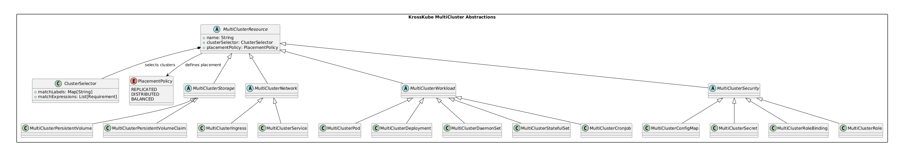

_Figure: KrossKube MultiCluster Abstractions Metamodel Package_

**_(Click on the figure for a full-screen view)_**

</div>

The `krosskube.multicluster` package introduces the high-level abstractions that extend native Kubernetes resources with multi-cluster management capabilities.

<br/>

The package architecture establishes inheritance hierarchies where concrete MultiCluster classes (**MultiClusterDeployment**, **MultiClusterService**, etc.) inherit from categorical abstract classes (**_MultiClusterWorkload_**, **_MultiClusterNetwork_**, etc.). This design ensures consistent interface patterns while enabling specialized behavior for different resource types.

The <ins>**_ClusterSelector_**</ins> and <ins>**_PlacementPolicy_**</ins> components provide reusable cluster targeting and distribution strategies across all MultiCluster resource types.

## Section II: Implementation & Technology Stack

## 3. Technology Stack

<div align="center">

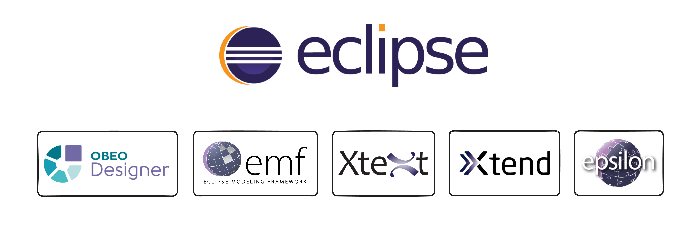

_Figure: KrossKube's Eclipse-Based Technology Stack_

</div>

KrossKube leverages the Eclipse Modeling ecosystem. The technology stack integrates multiple Eclipse technologies as **_plugins_** to deliver metamodel-based abstractions, domain-specific language capabilities, advanced model transformations, and automated code generation.

### 3.1 Eclipse Modeling Framework

<div align="center">

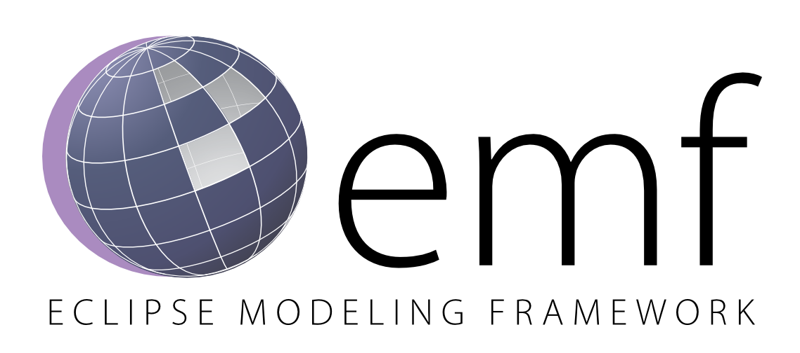

_Figure: Eclipse EMF: Eclipse Modeling Framework_

</div>

The Eclipse Modeling Framework (EMF) serves as **KrossKube's fundamental base layer**, providing the essential infrastructure that underpins the entire model-driven architecture. As the cornerstone technology, EMF establishes the structural foundation for defining, managing, and transforming KrossKube's metamodel ecosystem.

<ins>**Role as Base Layer**</ins>: EMF functions as the architectural bedrock that enables KrossKube's sophisticated metamodeling capabilities:

- **Metamodel Foundation**: EMF provides the core Ecore meta-metamodel that serves as the formal specification language for defining KrossKube's domain concepts, including MultiCluster resources, Kubernetes native abstractions, and their complex interrelationships.

- **Model Instance Infrastructure**: The framework establishes the runtime architecture for creating, manipulating, and persisting model instances, ensuring type safety and semantic consistency across all KrossKube model operations.

#### 3.1.1 Obeo Designer Integration

<div align="center">

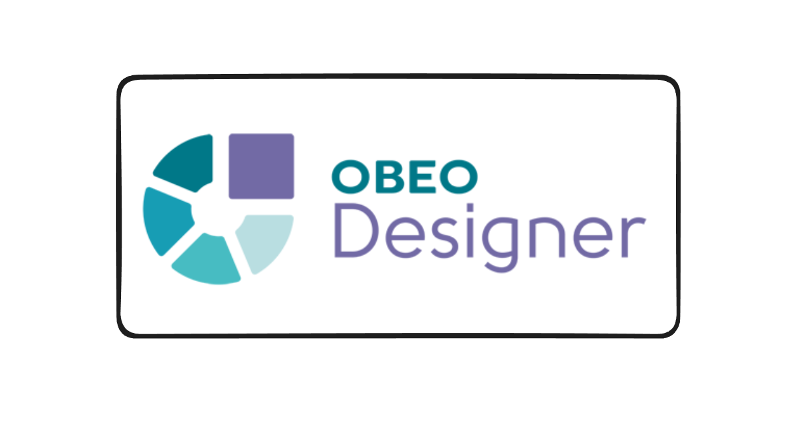

_Figure: Obeo Designer: MDE-ready Eclipse Package_

</div>

**Use Case**: KrossKube leverages Obeo Designer Community instead of a native Eclipse distribution because it provides a **ready-to-use integration** of the main Eclipse Modeling Project's components as a unified set of modeling frameworks, tooling, and standard implementations. This eliminates the complexity of manually configuring and integrating multiple Eclipse modeling plugins.

<ins>**Why Obeo Designer Over Native Eclipse?**</ins>:

Obeo Designer Community delivers a comprehensive, pre-configured modeling environment that includes:

- **EMF (Eclipse Modeling Framework)**: For building tools based on structured data models
- **Sirius (Graphical Modeling Framework)**: For creating sophisticated graphical editors
- **Ecore Tools**: For defining Domain-Specific Languages (DSLs)
- **EMF Compare**: For comparing and merging EMF models during collaborative development
- **Acceleo**: A template-based code generation language and toolkit
- **Integrated Validation Framework**: Real-time constraint checking and error reporting
- **Model Repository Management**: Version control and team collaboration features

This pre-integrated approach significantly reduces setup complexity and provides enterprise-grade modeling capabilities out-of-the-box, enabling domain experts to focus on KrossKube's architectural evolution rather than toolchain configuration.

#### 3.1.2 Ecore Metamodeling

**Use Case**: Ecore serves as KrossKube's **meta-metamodel**, providing the foundational language for defining the abstract syntax and semantic structure of KrossKube's domain concepts. It establishes the formal specification framework that enables precise definition of MultiCluster resources and their relationships with native Kubernetes components.

<ins>**Package-Oriented Architecture**</ins>: The KrossKube Ecore metamodel is implemented using a **modular package-oriented approach**, where each functional domain corresponds to a dedicated `.ecore` file. This architectural decision provides clear separation of concerns, enhanced maintainability, and modular evolution capabilities.

<div align="center">

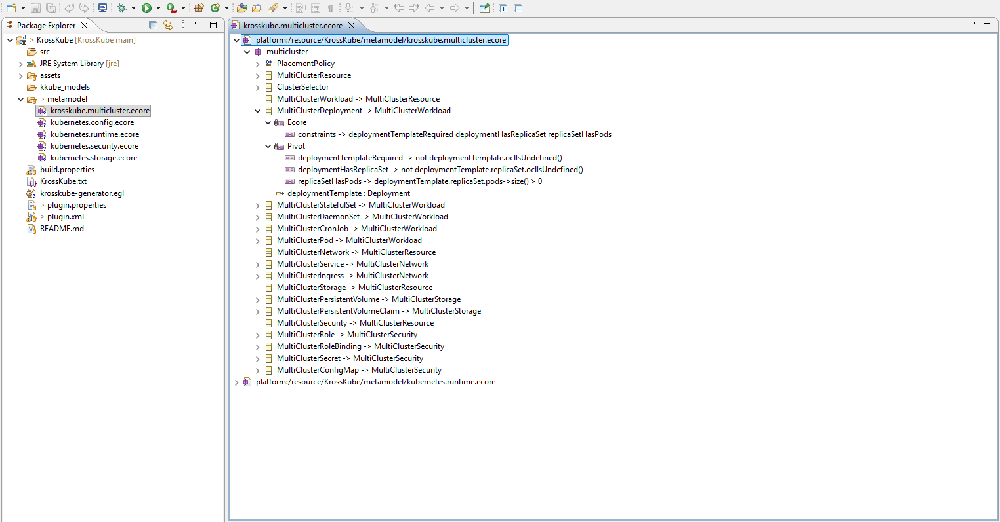

_Figure: KrossKube Multi-Cluster Package Structure in Ecore Editor_

</div>

<div align="center">

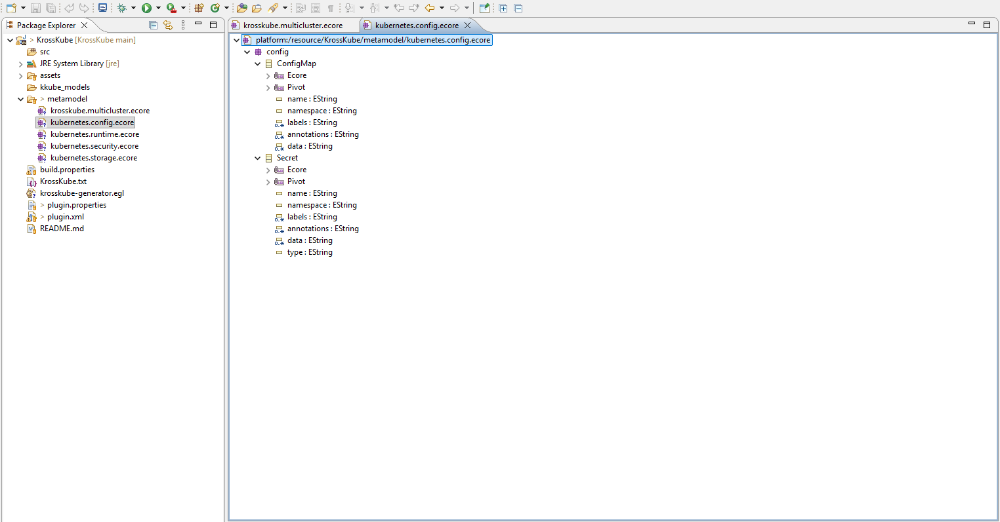

_Figure: Kubernetes Config Package Structure in Ecore Editor_

</div>

<div align="center">

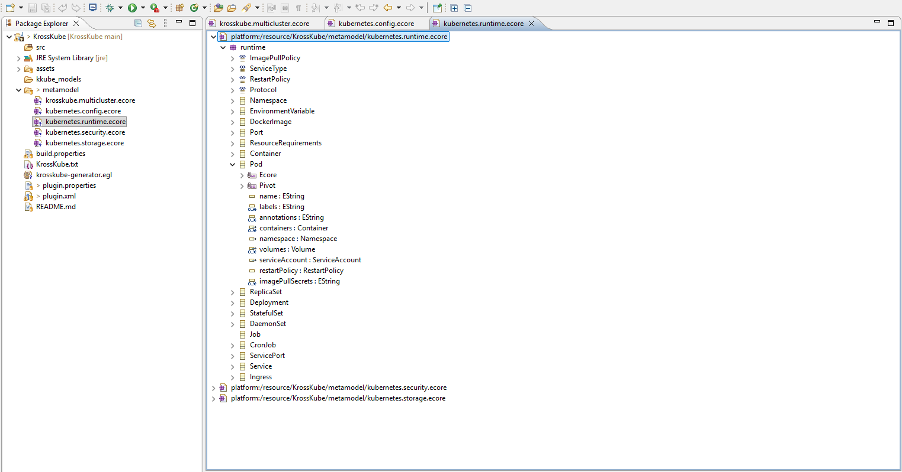

_Figure: Kubernetes Runtime Package Structure in Ecore Editor_

</div>

<div align="center">

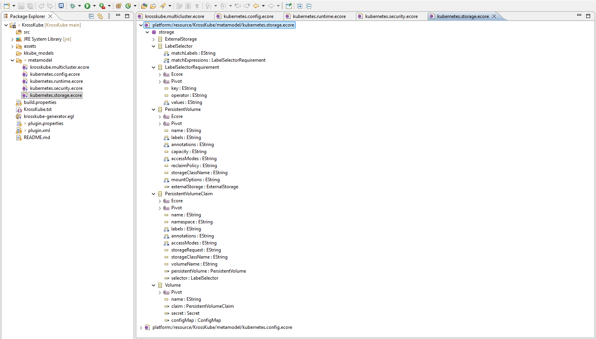

_Figure: Kubernetes Storage Package Structure in Ecore Editor_

</div>

<div align="center">

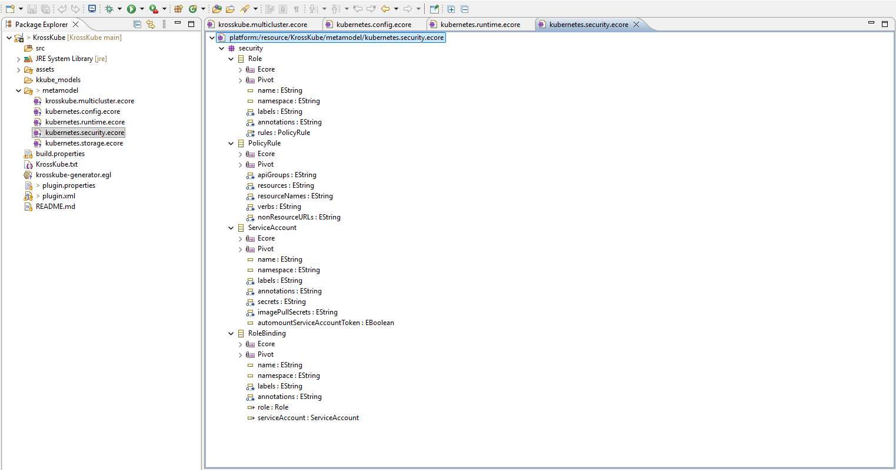

_Figure: Kubernetes Security Package Structure in Ecore Editor_

</div>

<ins>**Metamodel Package Structure**</ins>:

- **kubernetes.config.ecore**: Configuration management abstractions (ConfigMap, Secret)
- **kubernetes.runtime.ecore**: Workload and execution abstractions (Pod, Deployment, Service, etc.)
- **kubernetes.storage.ecore**: Persistent storage abstractions (PersistentVolume, PersistentVolumeClaim)
- **kubernetes.security.ecore**: RBAC and security abstractions (Role, RoleBinding, ServiceAccount)
- **krosskube.multicluster.ecore**: Multi-cluster management abstractions and placement policies

This package-oriented approach enables KrossKube to maintain a comprehensive yet manageable metamodel that scales with evolving Kubernetes specifications while preserving architectural integrity.

> **Check Metamodel Ecore Files**

> [-> /metamodel/krosskube.multicluster.ecore](./metamodel/krosskube.multicluster.ecore)

> [-> /metamodel/kubernetes.runtime.ecore](./metamodel/kubernetes.runtime.ecore)

> [-> /metamodel/kubernetes.storage.ecore](./metamodel/kubernetes.storage.ecore)

> [-> /metamodel/kubernetes.config.ecore](./metamodel/kubernetes.config.ecore)

> [-> /metamodel/kubernetes.security.ecore](./metamodel/kubernetes.security.ecore)

#### 3.1.3 EMF Java API Code Generation

**Use Case**: EMF's code generation capabilities automatically produce comprehensive Java implementation classes from the Ecore metamodel definition. This eliminates manual coding of model management infrastructure and ensures consistency between metamodel specification and runtime implementation.

<ins>**Generation Configuration**</ins>: The code generation process is orchestrated through the **[krosskube.genmodel](./metamodel/krosskube.genmodel)** file, which serves as the central configuration for EMF's generator framework. This GenModel file defines:

<div align="center">

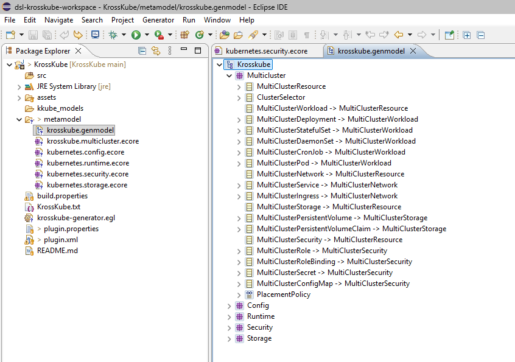

_Figure: Kubernetes Runtime Package Structure in Ecore Editor_

</div>

**Generated Java API Architecture**:

- **Model Classes**: Type-safe Java classes for all metamodel concepts with getter/setter accessors
- **Factory Classes**: Centralized creation patterns for model instance instantiation and management
- **Package Classes**: Registry and metadata management for each Ecore package
- **Serialization Framework**: XMI and XML serialization/deserialization support for model persistence
- **Notification System**: Observer pattern implementation for tracking model changes and evolution
- **Reflection API**: Runtime introspection capabilities for dynamic model manipulation
- **Validation Framework**: Integration hooks for OCL constraint evaluation and error reporting

<div align="center">


_Figure: Kubernetes Runtime Package Structure in Ecore Editor_

</div>

This automated generation approach reduces development effort by over **~80%** while maintaining perfect synchronization between metamodel specifications and runtime implementation, ensuring that KrossKube's model management infrastructure evolves consistently with its architectural design.

> **Check Genmodel File**

> [/metamodel/krosskube.genmodel](./metamodel/krosskube.genmodel)

#### 3.1.4 Object Constraint Language (OCL)

The KrossKube metamodel implements comprehensive OCL constraints enforcing semantic correctness and Kubernetes specification compliance across all model instances:

##### 4.1.4.1 Naming Conventions & Format Validation

**DNS Compliance**: All resources enforce Kubernetes naming rules:

```ocl
nameValidFormat: name.matches('[a-z0-9]([-a-z0-9]*[a-z0-9])?')
nameMaxLength: name.size() <= 253
nameRequired: not name.oclIsUndefined() and name.size() > 0
```

##### 4.1.4.2 Resource Template Consistency

**Template Structure Validation**:

```ocl
deploymentTemplateRequired: not deploymentTemplate.oclIsUndefined()
podHasContainers: podTemplate.containers->size() > 0
containerImagesSpecified: podTemplate.containers->forAll(c | not c.dockerImage.oclIsUndefined())
```

##### 4.1.4.3 Cluster Selection & Placement Validation

**Selector Logic Consistency**:

```ocl
hasMatchCriteria: matchLabels->size() > 0 or matchExpressions->size() > 0
clusterSelectorForDistribution: (placementPolicy = PlacementPolicy::DISTRIBUTED or
    placementPolicy = PlacementPolicy::BALANCED) implies not clusterSelector.oclIsUndefined()
```

##### 4.1.4.4 Data Integrity & Cross-Reference Validation

**Configuration & References**:

```ocl
dataNotEmpty: data->size() > 0
dataKeysValid: data->forAll(key | key.matches('[A-Za-z0-9._-]+'))
operatorValid: operator.matches('In|NotIn|Exists|DoesNotExist')
```

The constraint system integrates with Eclipse Modeling Framework validation infrastructure, providing real-time feedback during model development.

> **Check OCL contrsaints in the Metamodel Files**

> [/metamodel/\*.ecore/](./metamodel)

### 3.2 Domain-Specific Language

<div align="center">

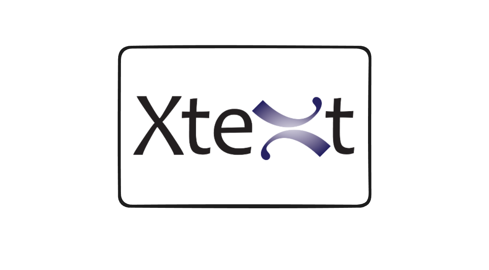

_Figure: Xtext-Based DSL Infrastructure_

</div>

KrossKube implements a custom Domain-Specific Language (DSL) using Eclipse Xtext to provide intuitive, textual syntax for defining MultiCluster resources. The DSL abstracts complex Kubernetes concepts into domain-friendly constructs while maintaining full expressiveness for multi-cluster deployment scenarios.

#### 3.2.1 Xtext Grammar Definition

**Use Case**: Xtext grammar defines the concrete syntax and parsing rules for the KrossKube DSL, enabling developers to express multi-cluster resource definitions using natural, declarative syntax rather than verbose XML or programmatic APIs.

<div align="center">

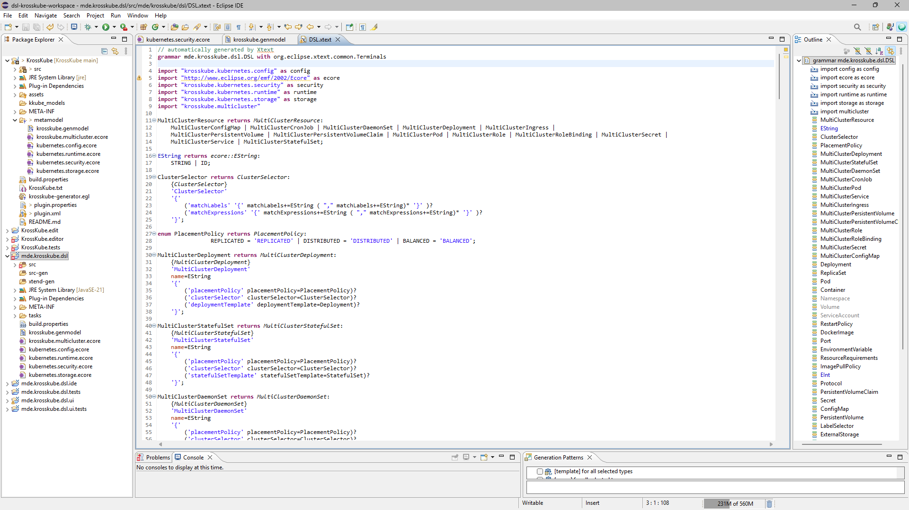

_Figure: Xtext DSL Grammar Generated from the KrossKube's .genmodel_

</div>

**Implementation**: The grammar specification establishes:

```xtext
/**
    Base DSL rule for MultiClutser resources
*/
MultiClusterResource returns MultiClusterResource:
    MultiClusterConfigMap | MultiClusterCronJob | MultiClusterDaemonSet |
    MultiClusterDeployment | MultiClusterIngress | MultiClusterPersistentVolume |
    MultiClusterPersistentVolumeClaim | MultiClusterPod | MultiClusterRole |
    MultiClusterRoleBinding | MultiClusterSecret | MultiClusterService |
    MultiClusterStatefulSet;
```

**Cluster Selection Syntax**:

```xtext
ClusterSelector returns ClusterSelector:
    {ClusterSelector}
    'ClusterSelector'
    '{'
        ('matchLabels' '{' matchLabels+=EString ( "," matchLabels+=EString)* '}' )?
        ('matchExpressions' '{' matchExpressions+=EString ( "," matchExpressions+=EString)* '}' )?
    '}';
```

**Placement Policy Enumeration**:

```xtext
enum PlacementPolicy returns PlacementPolicy:
    REPLICATED = 'REPLICATED' | DISTRIBUTED = 'DISTRIBUTED' | BALANCED = 'BALANCED';
```

**Resource Template Definitions**: The grammar supports comprehensive resource template specifications, such as:

```xtext
MultiClusterDeployment returns MultiClusterDeployment:
    {MultiClusterDeployment}
    'MultiClusterDeployment'
    name=EString
    '{'
        ('clusterSelector' clusterSelector=ClusterSelector)?
        ('placementPolicy' placementPolicy=PlacementPolicy)?
        ('deploymentTemplate' deploymentTemplate=Deployment)?
    '}';
```

This grammar enables developers to express complex multi-cluster deployments with intuitive syntax while maintaining type safety and semantic validation.

> **Check DSL Grammar File**

> [/mde.krosskube.dsl/src/mde/krosskube/dsl/Dsl.xtext](./mde.krosskube.dsl/src/mde/krosskube/dsl/Dsl.xtext)

#### 3.2.2 Runtime Eclipse IDE Integration

<div align="center">

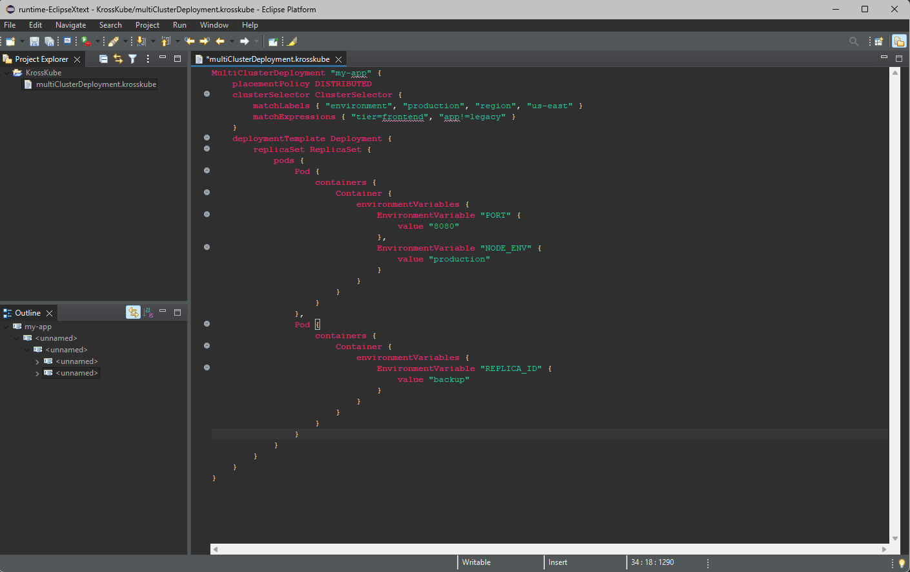

_Figure: A highlighted KrossKube model in KrossKube's Runtime Eclipse IDE_

</div>

<div align="center">

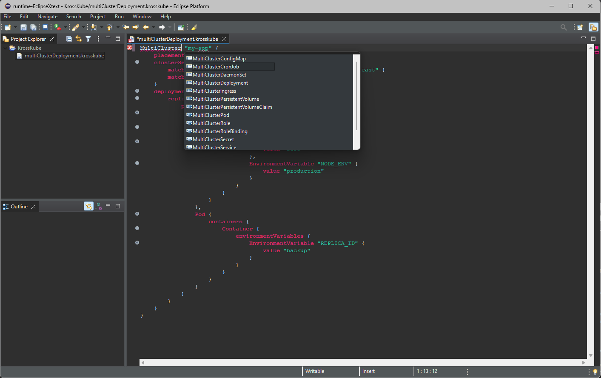

_Figure: Autocompletion of KrossKube model in the Runtime Eclipse IDE_

</div>

**Use Case**: Native Eclipse IDE integration provides developers with familiar tooling for KrossKube DSL development, including syntax highlighting, error markers, outline views, and debugging capabilities.

**Implementation**: The integration includes:

- **Syntax Highlighting**: Domain-specific color coding for DSL elements
- **Error Markers**: Real-time validation with inline error indicators
- **Outline View**: Hierarchical navigation for model structures
- **Quick Fixes**: Automated resolution suggestions for common issues

This integration enables the adoption of KrossKube DSL within existing Eclipse-based development environments, with Xtend providing additional code generation and transformation capabilities for advanced use cases.

### 3.3 Model-To-Text Transformation Engine

<div align="center">


_Figure: Epsilon-Based Model Management and Code Generation_

</div>

The Model-to-Text transformation engine leverages Eclipse <ins>**Epsilon's Generation Language (EGL)**</ins> to automate the production of Kubernetes Custom Resource Definitions (CRDs) and deployment manifests from high-level MultiCluster resource models.

#### 3.3.1 Epsilon Generation Language (EGL)

**Use Case**: EGL provides template-based code generation capabilities that transform abstract KrossKube models into concrete Kubernetes YAML manifests. This bridge enables organizations to work with high-level abstractions while generating standard Kubernetes resources for deployment.

**EGL Template Example Structure**:

```egl
[% for deployment in MultiClusterDeployment.all %]
---
apiVersion: apps/v1
kind: Deployment
metadata:
  name: [%=deployment.name%]
  namespace: [%=deployment.namespace%]
  labels:
    krosskube.managed: "true"
    krosskube.placement-policy: "[%=deployment.placementPolicy%]"
spec:
  replicas: [%=deployment.deploymentTemplate.replicas%]
  [% /* Template continues with full Kubernetes Deployment specification */ %]
[% endfor %]
```

This transformation approach enables organizations to maintain high-level, reusable model definitions while generating deployment-specific Kubernetes resources that integrate with existing operational workflows.

### 3.4 Xtend Integration

<div align="center">


_Figure: Xtend: Java-Compatible Template Language_

</div>

Xtend serves as a powerful complement to the EGL-based code generation system, providing Java-compatible template processing and advanced model transformation capabilities. The integration of Xtend enhances KrossKube's code generation pipeline with type-safe templates, powerful expression syntax, and seamless Java ecosystem integration.

**Use Case**: Xtend templates provide an alternative and complementary approach to EGL for generating Kubernetes YAML manifests. The Java-compatible syntax enables more sophisticated generation logic while maintaining readability and maintainability.

**Implementation**: Xtend templates leverage string interpolation and powerful expression syntax:

```xtend
class KubernetesGenerator {

    def generateDeployment(MultiClusterDeployment deployment) '''
        ---
        apiVersion: apps/v1
        kind: Deployment
        metadata:
          name: «deployment.name»
          namespace: «deployment.namespace»
          labels:
            krosskube.managed: "true"
            krosskube.placement-policy: "«deployment.placementPolicy»"
        spec:
          replicas: «deployment.deploymentTemplate.replicas»
          selector:
            matchLabels:
              «FOR label : deployment.deploymentTemplate.podTemplate.labels SEPARATOR '\n'»
              «label.key»: "«label.value»"
              «ENDFOR»
    '''
}
```

The Xtend integration positions KrossKube as a comprehensive platform that bridges high-level modeling abstractions with enterprise-grade deployment automation, providing both template-based generation and programmatic extensibility.

## 4. Code Generation

The code generation subsystem represents the culmination of KrossKube's Model-Driven Engineering approach, transforming the high-level MultiCluster resource models into valid Kubernetes YAML CRD manifests.

### 4.1 Template-Based Generation

The generation system leverages EGL: Epsilon's Generation Language (EGL) to implement sophisticated template-based transformation patterns:

<div align="center">

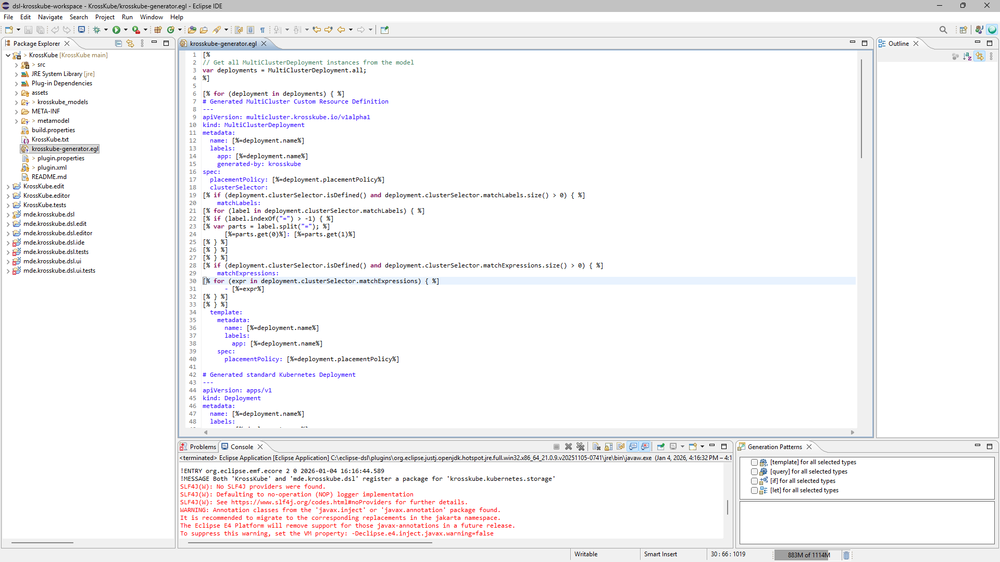

_Figure: EGL Template Structure for KrossKube's MultiCluster Resource Generation_

</div>

**Template Processing Workflow**:

1. **Model Analysis**: Parse MultiCluster resource definitions and extract cluster targeting policies
2. **Template Application**: Apply EGL templates to generate both Custom Resource Definitions and standard Kubernetes resources
3. **Multi-Artifact Generation**: Produce comprehensive deployment packages including:
   - **MultiCluster Custom Resource Definitions**: High-level abstractions with placement policies
   - **Standard Kubernetes Deployments**: Native workload specifications
   - **Service Definitions**: Network exposure and load balancing configurations
   - **Configuration Resources**: ConfigMaps, Secrets, and RBAC policies

**Generated Artifact Structure**:

The template system generates multiple coordinated Kubernetes resources for each MultiCluster definition:

```yaml
# MultiCluster Custom Resource Definition
apiVersion: multicluster.krosskube.io/v1alpha1
kind: MultiClusterDeployment
metadata:
  name: web-app
  labels:
    generated-by: krosskube
spec:
  placementPolicy: DISTRIBUTED
  clusterSelector:
    matchLabels:
      environment: production

# Standard Kubernetes Deployment
apiVersion: apps/v1
kind: Deployment
metadata:
  name: web-app
  labels:
    managed-by: krosskube
spec:
  replicas: 3
  # ... complete deployment specification
```

> **Check KrossKube's EGL Template**

> [-> /krosskube-generator.egl](./krosskube-generator.egl)

### 4.2 Model-to-Text Transformations

**Use Case**: The model-to-text transformation pipeline provides the execution engine for converting abstract MultiCluster models into deployable YAML artifacts. This automated process eliminates manual manifest creation while ensuring consistency and compliance with Kubernetes specifications.

**Transformation Engine**: The EGL-based transformation system implements comprehensive model traversal and template processing capabilities:

<div align="center">

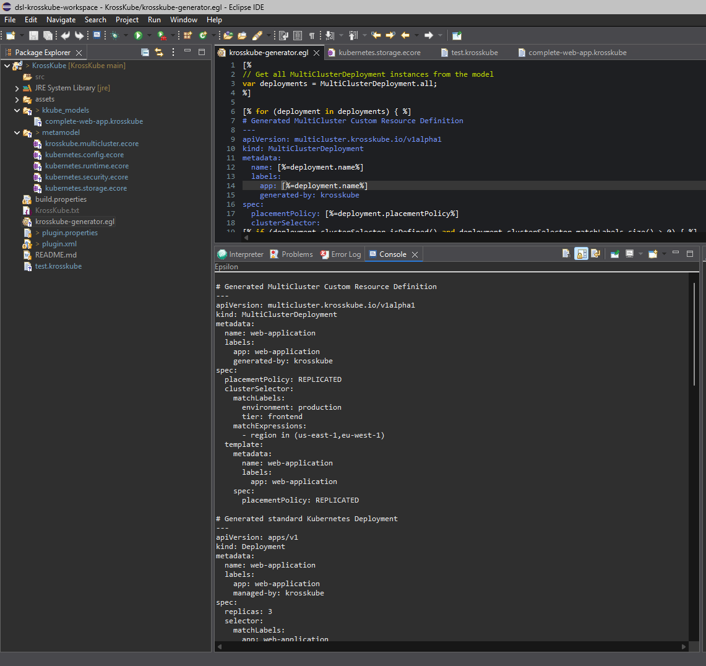

_Figure: Successful YAML Generation from MultiCluster Models_

</div>

**Transformation Process**:

1. **Model Loading**: Import MultiCluster resource models from DSL specifications or serialized model files
2. **Constraint Validation**: Execute OCL constraints to ensure model consistency and Kubernetes compliance
3. **Template Orchestration**: Apply hierarchical template processing with dependency resolution
4. **Artifact Generation**: Produce organized YAML manifests with proper metadata and cross-references
5. **Validation**: Verify generated resources against Kubernetes schemas and operational policies

The template-based generation approach ensures that KrossKube maintains perfect fidelity between high-level model specifications and operational deployment artifacts, enabling reliable multi-cluster resource management at enterprise scale.

---

## Section III: Usage & Reference

## 5. Examples

### 5.1 Basic Models Examples

### 5.2 Advanced Models Examples

## 6. End-to-end Practical Walkthrough
